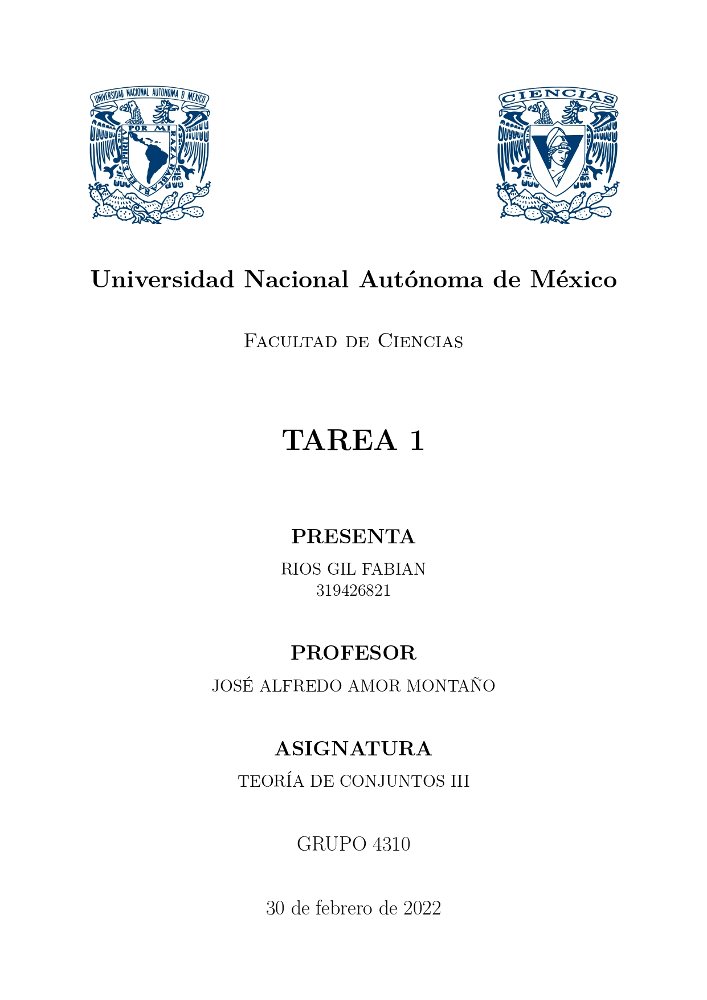
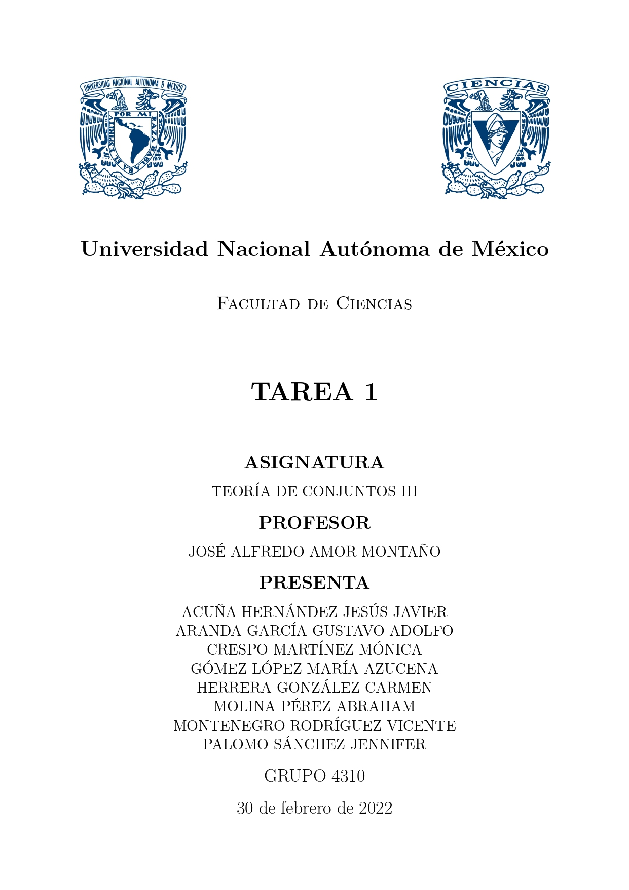

<h1 align="center"> Plantillas UNAM LaTeX </h1>

Este proyecto es un conjunto de plantillas hechas en LaTeX que serán de utilidad a estudiantes de la Facultad de Ciencias de la UNAM.

## Tabla de Contenido

- [Demo](#demo)
- [Contenido](#contenido)
- [Licencia](#licencia)
- [Autor](#autor)

## Demo

## Contenido

- [Plantilla Portada Individual](./Plantilla-Portada-Individual/)
- [Plantilla Portada Equipo](./Plantilla-Portada-Equipo/)

## Licencia

> This project is licensed under the MIT License

## Autor

Hecho por [Fabián Ríos](https://www.linkedin.com/in/soyfabianrg/)